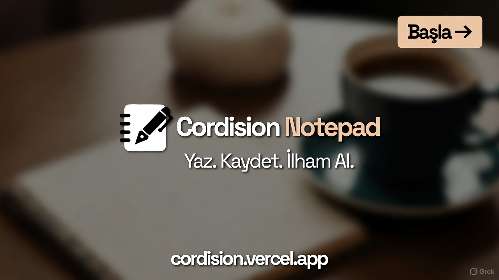

# Soft Cordision Notepad



Electron ve React tabanlı, modern bir notepad uygulaması.  
Tailwind CSS ile tasarlandı, hızlı ve kullanışlıdır.

## Özellikler

- Modern React arayüzü
- Tailwind CSS ile responsive tasarım
- Electron ile masaüstü uygulama deneyimi
- Dosya kaydetme ve yükleme desteği
- Dark/Light theme toggle
- Çoklu platform desteği (Windows, Mac, Linux)

## Başlangıç (Development)

1. Repo’yu klonla:

```bash
git clone https://github.com/TPashaxrd/react-best-ui-notepad.git
cd react-best-ui-notepad
````

2. Bağımlılıkları yükle:

```bash
npm install
cd frontend
npm install
cd ..
```

3. React frontend’i başlat:

```bash
cd frontend
npm run dev
```

4. Electron uygulamasını çalıştır:

```bash
npm start
```

> Uygulama `localhost:5173` üzerinden React geliştirme sürümünü yükleyecek ve Electron penceresi açılacaktır.

---

## Build (Production)

1. React frontend’i build et:

```bash
cd frontend
npm run build
cd ..
```

2. Electron üretim sürümünü paketle:

```bash
npm run build
```

* Bu işlem `dist_electron` veya `release` klasöründe `.exe` dosyası ve installer oluşturacaktır (Windows için).
* Mac ve Linux için platforma özel paketler de üretilebilir.

---

## Yapı ve Dosya Düzeni

```
react-best-ui-notepad/
├─ frontend/            # React uygulaması
│  ├─ src/
│  ├─ public/
│  └─ dist/             # build sonrası
├─ main.js              # Electron ana dosyası
├─ package.json
├─ vite.config.js
└─ README.md
```

---

## Önemli Notlar

* Tailwind CSS CDN kullanımı production için önerilmez, PostCSS veya CLI ile derleyin.
* Electron geliştirici sürümünde DevTools açık gelir; production’da kapalı olmalıdır.
* Güvenlik için Content Security Policy (CSP) ayarlanması önerilir.

---

## Lisans

MIT License

```